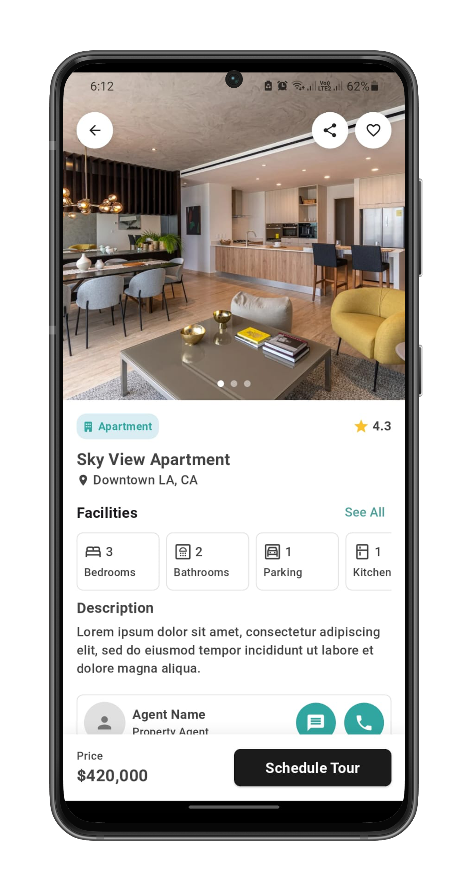
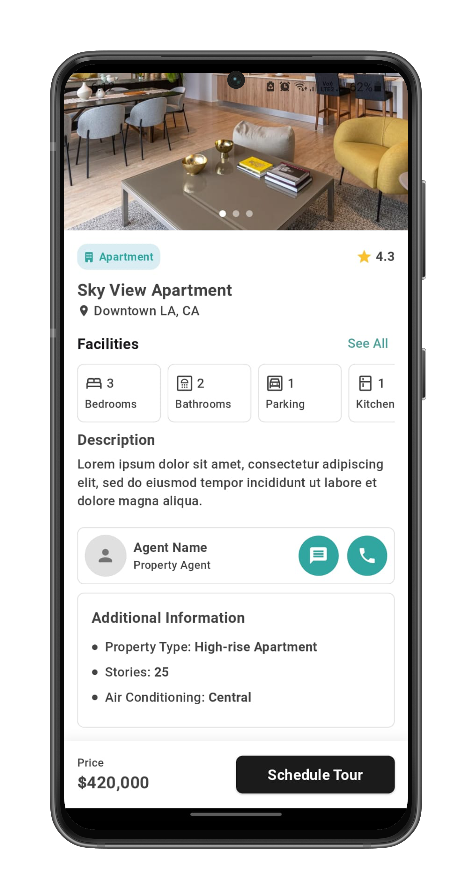
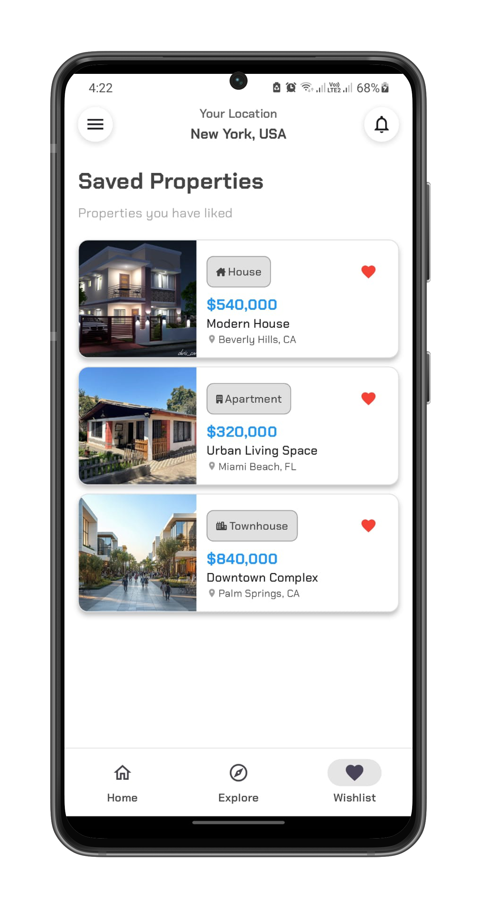
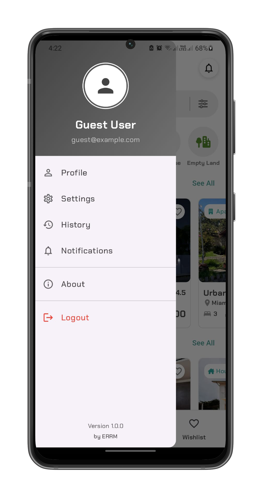
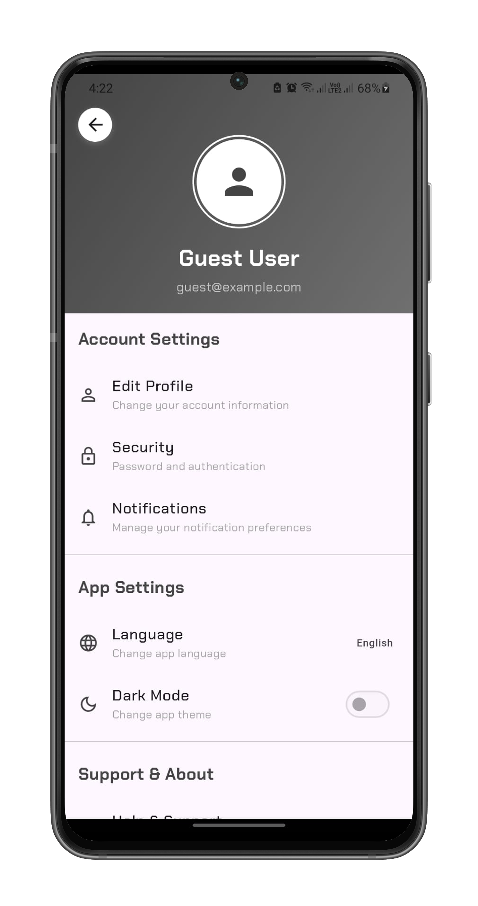
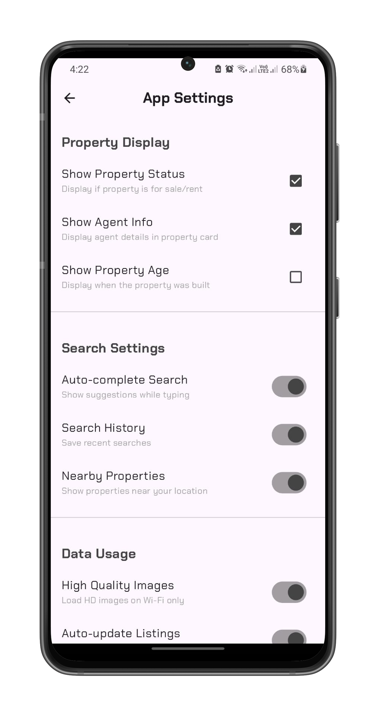

# BrixFind 🏠

BrixFind es una aplicación inmobiliaria moderna desarrollada con Flutter que facilita la búsqueda de propiedades. Ofrece una experiencia fluida para explorar inmuebles, guardar favoritos y conectar con agentes inmobiliarios.

> ⚠️ **Nota**: Este proyecto es un prototipo/mockup diseñado con fines demostrativos y educativos.

## 📱 Capturas de Pantalla

<p float="left">
  
  
  
  
  
  
  
  
</p>

## ✨ Características

- **Búsqueda Simulada**: Demostración de filtros y opciones de búsqueda
- **Vista Detallada**: Ejemplos de presentación de propiedades con imágenes de muestra
- **Lista de Favoritos**: Simulación del sistema de guardado de propiedades
- **Perfiles de Usuario**: Demostración de la experiencia de usuario personalizada
- **Interfaz Moderna**: Implementación de Material Design con ejemplos prácticos

## 🛠️ Tecnologías Utilizadas

- Flutter
- Riverpod para gestión de estado
- Go Router para navegación
- Google Fonts
- Animaciones personalizadas

## 🚀 Comenzando

### Requisitos Previos

- Flutter (Channel stable)
- Dart SDK (^3.7.0)

### Instalación

1. Clona el repositorio:
```bash
git clone https://github.com/stebann/brixfind.git
```

2. Navega al directorio del proyecto:
```bash
cd brixfind
```

3. Instala las dependencias:
```bash
flutter pub get
```

4. Ejecuta la aplicación:
```bash
flutter run
```

## 📝 Estructura del Proyecto

```
lib/
├── src/
│   ├── config/         # Configuración de la app
│   ├── models/         # Modelos de datos
│   ├── presentation/   # Componentes de UI
│       ├── providers/      # Gestión de estado
│   └── utils/         # Utilidades y helpers
```

## 👨‍💻 Desarrollador

- **Esteban Ramirez**
  - GitHub: [@stebann](https://github.com/stebann)
  - LinkedIn: [estebanrramirezm](https://linkedin.com/in/estebanrramirezm)
